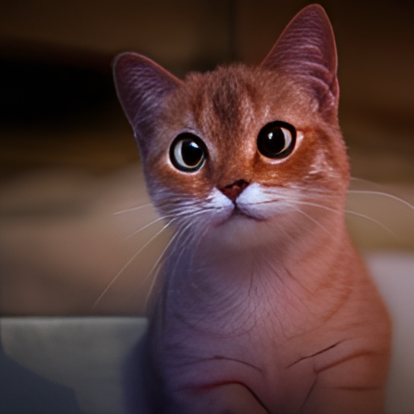
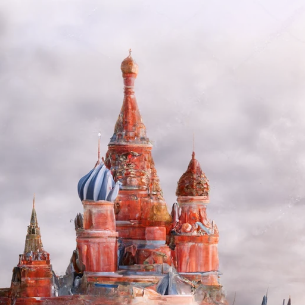

# ruDALL-E diffusion

ruDALL-E diffusion is regular ruDALL-E with a diffusion decoder, similar to [dall-3](https://github.com/Jack000/DALLE-pytorch/)
Decoding VQ embeddings with a DDPM model can produce much more realistic fine-grain details than VQVAE and VQGAN.

the only code change to ruDALL-E is to return the image tokens in generate_images() - the actual diffusion model is here: https://github.com/Jack000/guided-diffusion

# Samples
| ruDALL-E + real-ESRGAN | diffusion |
| --- | --- |
| </img> | </img> |
| </img> | </img> |
| </img> | </img> |
| </img> | </img> |

note that the results depend a lot on the seed value

base image:
</img>

diffusion-generated samples (different seeds):
| &nbsp; | &nbsp; | &nbsp; |
| --- | --- | --- |
| </img> | </img> | </img> |
| </img> | </img> | </img> |

### generation by ruDALLE:
```python
from rudalle.pipelines import generate_images, show, super_resolution, cherry_pick_by_clip
from rudalle import get_rudalle_model, get_tokenizer, get_vae, get_realesrgan, get_ruclip
from rudalle.utils import seed_everything
import numpy as np

# prepare models:
device = 'cuda'
dalle = get_rudalle_model('Malevich', pretrained=True, fp16=True, device=device)
tokenizer = get_tokenizer()
vae = get_vae(dwt=False).to(device) # Make sure to set dwt to False!

text = 'изображение радуги на фоне ночного города'

seed_everything(42)
pil_images = []
scores = []
codes = []

for top_k, top_p, images_num in [
    (2048, 0.995, 3),
    (1536, 0.99, 3),
    (1024, 0.99, 3),
    (1024, 0.98, 3),
    (512, 0.97, 3),
    (384, 0.96, 3),
    (256, 0.95, 3),
    (128, 0.95, 3),
]:
    _pil_images, _scores, _codes = generate_images(text, tokenizer, dalle, vae, top_k=top_k, images_num=images_num, top_p=top_p, return_codes=True)
    pil_images += _pil_images
    scores += _scores
    codes += _codes

sr_images = super_resolution(pil_images, realesrgan)

for i, im in enumerate(pil_images):
    im.save(str(i)+'.png')
    sr_images[i].save(str(i)+'sr.png')
    with open(str(i)+'.npy', 'wb') as f:
        np.save(f, codes[i])

# afterward, pass .npy file to diffusion model https://github.com/Jack000/guided-diffusion
```
